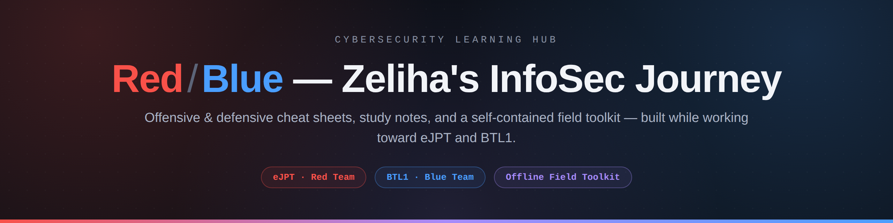
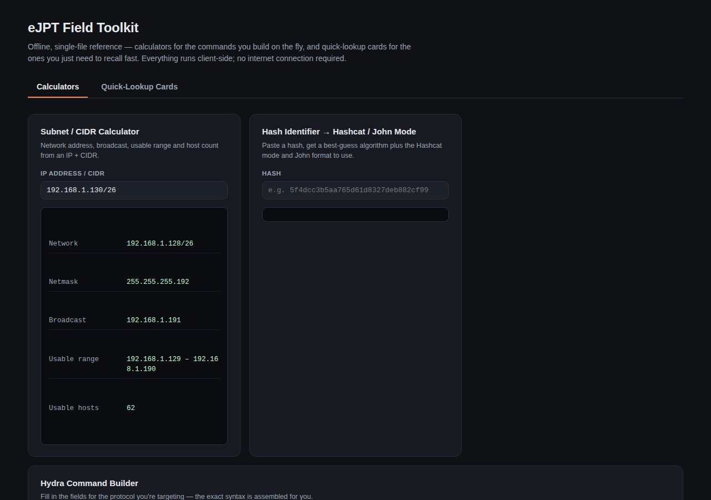

<p align="center">
  
</p>

<p align="center">
  <a href="https://github.com/zelihazenginapogeeusa-byte/zeliha-infosec-journey/stargazers"></a>
  <a href="https://github.com/zelihazenginapogeeusa-byte/zeliha-infosec-journey/network/members"></a>
  <a href="https://github.com/zelihazenginapogeeusa-byte/zeliha-infosec-journey/watchers"></a>
  <a href="https://github.com/zelihazenginapogeeusa-byte/zeliha-infosec-journey/commits/cybersecurity-learning-hub"></a>
  
</p>

<p align="center">
  <b>A personal, continuously-updated cybersecurity study repo</b><br>
  Offensive-side notes for <b>eJPT</b> and defensive-side notes for <b>BTL1</b> — cheat sheets, an offline field toolkit, and a study roadmap.
</p>

<p align="center">
  <sub>Senior SOC Analyst &amp; Facilitator — expanding into offensive security through eJPT &amp; BTL1.</sub>
</p>

<p align="center">
  <a href="https://zelihazenginapogeeusa-byte.github.io/zeliha-infosec-journey/field-toolkit_2.html"><b>🧰 Open the Field Toolkit (live)</b></a> ·
  <a href="ejpt-roadmap.md"><b>📄 Study Roadmap</b></a>
</p>

<p align="center">
  <a href="https://www.linkedin.com/in/zeliha-zengin/"></a>
  <a href="https://medium.com/@zeliharich"></a>
</p>

---

## 📖 What's in here

This repo collects everything gathered while studying for the **eJPT** (eLearnSecurity Junior Penetration Tester) and **BTL1** (Blue Team Level 1) certifications: practical, command-heavy cheat sheets — not theory dumps — each covering one tool or one concept, cross-referenced against its siblings.

|  | Folder | Focus |
|---|---|---|
| 🔴 | [`Red-Team/`](Red-Team/) | Recon, enumeration, exploitation, post-exploitation, reporting — eJPT-aligned |
| 🔵 | [`Blue-Team/`](Blue-Team/) | Detection, triage, forensics, incident response — BTL1-aligned |
| 🟣 | [`Purple-Team-Mapping/`](./Purple-Team-Mapping) | Attack ↔ detection cross-reference — ties Red-Team techniques to Blue-Team detections across ten kill-chain stages |
| 🎯 | [`Interview-Prep/`](./Interview-Prep) | Interview Q&A — fundamentals, red team, blue team, behavioral, junior pentest — in flashcard format, plus an interactive study app |
| 🧰 | [`field-toolkit_2.html`](https://zelihazenginapogeeusa-byte.github.io/zeliha-infosec-journey/field-toolkit_2.html) | Offline, single-file interactive reference — calculators + quick-lookup cards, no install needed (link opens the live version) |
| 📘 | [`blue-team-study-notes_1.html`](https://zelihazenginapogeeusa-byte.github.io/zeliha-infosec-journey/Blue-Team/blue-team-study-notes_1.html) | Interactive BTL1 study reference — curriculum prioritized by importance, click-to-expand notes with real commands/workflows (Splunk SPL, Wireshark filters, Volatility, DeepBlueCLI, Autopsy, TheHive, report template) |
| ⏱️ | [btl1-exam-tracker.html](https://htmlpreview.github.io/?https://github.com/zelihazenginapogeeusa-byte/zeliha-infosec-journey/blob/cybersecurity-learning-hub/Blue-Team/btl1-exam-tracker.html) | Interactive BTL1 exam companion — 24h timer + pacing, IOC table, timeline, host/network activity map (Wireshark-ready), MITRE ATT&CK checklist, confidence tracking, and auto-generated report draft (link opens the live version) |
| 🗺️ | [`ejpt-roadmap.md`](ejpt-roadmap.md) | Study roadmap / progress tracker |
| 📕 | [`ejpt-study-notes.html`](https://zelihazenginapogeeusa-byte.github.io/zeliha-infosec-journey/Red-Team/ejpt-study-notes.html) | Interactive eJPT study reference — curriculum mapped to your actual course order (TryHackMe Pre-Security → INE eJPTv2 → Junior Pentester Path → Beginner's/Offensive Pentesting Path), click-to-expand notes with real commands/workflows (enumeration, web app testing, Metasploit, Active Directory, pivoting) |
| 🧭 | [ejpt-study-reference.html](https://htmlpreview.github.io/?https://github.com/zelihazenginapogeeusa-byte/zeliha-infosec-journey/blob/cybersecurity-learning-hub/Red-Team/ejpt-study-reference.html) | Interactive eJPT exam companion — 48h timer + pacing, Hosts/Loot/Timeline tracking, coverage bar, confidence tracking, quick-reference cheat sheet (Nmap, enumeration, web app, Metasploit, privesc, pivoting, AD), Toolbox calculators (Epoch, Base64, hash ID, hex/dec + IP/CIDR), auto-generated report draft |
| 📋 | [`playbook-index.md`](playbook-index.md) | Quick-access index of every scenario playbook — "which alert just fired, which playbook do I open" |
| 🔍 | [osint-field-toolkit.html](https://zelihazenginapogeeusa-byte.github.io/zeliha-infosec-journey/osint-field-toolkit.html) | Interactive OSINT investigation reference — 58 tools across 7 categories (email/domain, IP/infrastructure, URL/file sandboxing, phishing intel, threat & breach intel, social/identity, image/metadata) plus a Frameworks & Methodology category (MITRE ATT&CK, D3FEND, Pyramid of Pain, Diamond Model, Cyber Kill Chain, PICERL, STIX/TAXII, MISP, OpenCTI), each with a click-through panel: usage notes, input → output, and an OPSEC reminder. BTL1 phishing analysis + eJPT recon aligned. |
| 🎣 | [phishing-analysis-field-guide.html](https://zelihazenginapogeeusa-byte.github.io/zeliha-infosec-journey/phishing-analysis-field-guide.html) | Interactive phishing analysis methodology reference — header analysis, SPF/DKIM/DMARC, sender & domain red flags, content & social-engineering patterns, attachment & link analysis, and IOC extraction, each with a click-through panel: what to check and why. BTL1-aligned. |
| 📡 | [splunk-field-guide.html](https://zelihazenginapogeeusa-byte.github.io/zeliha-infosec-journey/splunk-field-guide.html) | SPL and Windows Event ID reference for SIEM triage — default fields, search commands, Security & Sysmon Event IDs (including Kerberos, DCSync, scheduled-task and password-reset events), network beaconing detection, and email/endpoint/network/DNS/web/auth/account-management fields, each with a ready SPL query. BTL1-aligned. |
| 🦈 | [wireshark-field-guide.html](https://zelihazenginapogeeusa-byte.github.io/zeliha-infosec-journey/wireshark-field-guide.html) | Wireshark field and display-filter reference for packet capture review — TCP flags & Nmap scan signatures, HTTP/DNS/TLS/ARP/DHCP fields, a common-ports quick reference, and credential-exposure indicators. BTL1-aligned. |
| 💻 | [live-host-triage-field-guide.html](https://zelihazenginapogeeusa-byte.github.io/zeliha-infosec-journey/live-host-triage-field-guide.html) | Live Windows host triage reference — CLI/PowerShell commands for network, process & service, account, and persistence checks, run before the system is ever imaged or its memory captured. BTL1-aligned. |
| 💽 | [autopsy-field-guide.html](https://zelihazenginapogeeusa-byte.github.io/zeliha-infosec-journey/autopsy-field-guide.html) | Interactive Autopsy disk forensics reference — case/ingest setup, timeline & MACB analysis, deleted files & carving, keyword/hash search, web & OS artifacts, registry/email/EXIF, and tagging/reporting, each with a click-through panel: what to look for and exactly where to find it. BTL1-aligned. |
| 🔷 | [deepblue-field-guide.html](https://zelihazenginapogeeusa-byte.github.io/zeliha-infosec-journey/deepblue-field-guide.html) | Interactive DeepBlueCLI reference for Windows Event Log triage — usage & parameters plus detection patterns (brute force, credential dumping, obfuscated PowerShell, persistence, log clearing), each with the exact detection string and Event ID. BTL1-aligned. |
| 🧠 | [volatility-field-guide.html](https://zelihazenginapogeeusa-byte.github.io/zeliha-infosec-journey/volatility-field-guide.html) | Interactive Volatility memory forensics reference — acquisition & setup, process analysis, process internals, injection & hooking, network & registry (including credential extraction), and timeline & file activity, each with the exact plugin command. BTL1-aligned. |

Both folders are organized into numbered sub-folders that roughly follow the order you'd actually work through them — recon before exploitation on the Red-Team side, alert-triage before deep forensics on the Blue-Team side. See each folder's own `README.md` for the full file index.

---

## 🧰 Try the field toolkit

`field-toolkit_2.html` is a single, self-contained file — calculators (Base64, hash identifier, subnet/CIDR, Hydra command builder, reverse shell generator, and more) plus quick-reference cards for both red and blue team work, filterable by category. No server, no dependencies, no accounts, works fully offline.

<p align="center">
  
</p>

**View it live** — GitHub Pages is already enabled on this repo's default branch (`cybersecurity-learning-hub`), so it's reachable right now at:

```
https://zelihazenginapogeeusa-byte.github.io/zeliha-infosec-journey/field-toolkit_2.html
```

*(optional: rename `field-toolkit_2.html` to `index.html` at the repo root if you'd rather the short root URL — `.../zeliha-infosec-journey/` — load it directly)*

---

## 🗂️ Repo structure

```
zeliha-infosec-journey/
├── README.md
├── LICENSE
├── banner.png
├── field-toolkit_2.html
├── toolkit-preview.png
├── ejpt-roadmap.md
├── playbook-index.md
├── Red-Team/
│   ├── README.md
│   ├── 01-Recon-and-OSINT/
│   │   ├── assessment-methodology-report-writing-cheatsheet-professional.md   (shared w/ Blue-Team)
│   │   ├── osint-cheatsheet.md
│   │   ├── ejpt-exam-checklist-and-methodology.md
│   │   └── ... (4 more)
│   ├── 02-Web-and-Network-Pentesting/
│   │   ├── nmap-cheatsheet-professional.md
│   │   ├── gobuster-cheatsheet-professional.md
│   │   └── ... (6 more)
│   └── 03-Exploitation-and-Post-Exploitation/
│       ├── active-directory-enumeration-cheatsheet-professional.md
│       ├── active-directory-attack-chain-playbook.md
│       ├── metasploit-cheatsheet-professional.md
│       └── ... (12 more)
└── Blue-Team/
    ├── README.md
    ├── 01-SOC-and-SIEM-Analysis/
    │   ├── siem-splunk-elk-cheatsheet-professional.md
    │   ├── splunk-siem-investigation-playbook.md
    │   └── ... (5 more)
    └── 02-DFIR-and-Threat-Intelligence/
        ├── volatility-autopsy-forensics-cheatsheet-professional.md
        ├── phishing-cheatsheet.md
        ├── ransomware-incident-response-playbook.md
        └── ... (11 more)
```

*(exact counts drift as new files get added — each folder's own `README.md` is always the source of truth for what's currently inside it.)*

---

## ⚠️ Scope

All techniques documented here are for use in **authorized environments only** — personal labs, CTFs, and engagements covered by written authorization (RoE). Nothing in this repo should be used against systems without explicit permission.

---

<p align="center"><sub>Built while studying — updated as new modules get covered.</sub></p>
